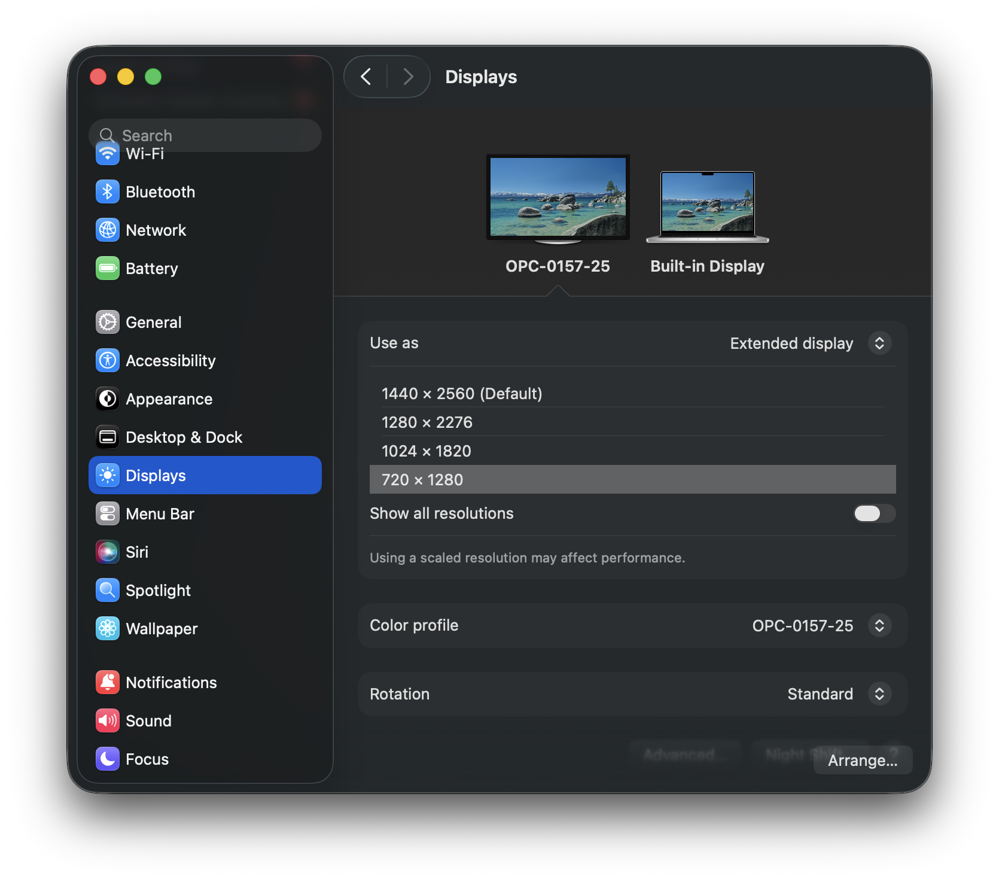

# CubeVi Swizzle Godot

Godot support for light field display [Companion 01](https://www.openstageai.com/companion1). Ported from [official Unity SDK](https://github.com/CubeVi/CubeVi-Swizzle-Unity).

Currently tested on macOS/Linux(Wayland). After wiring the display with HDMI cable, following the platform specific setup.

## Platform

### macOS

1. System Setting -> Displays. Set resolution to 720x1280 

Mac applys the same DPI scale on ALL display. Need to manually turn down resolution to have correct final output size.

2. Copy device calibration info from your Windows machine.

The device only supports windows officially. On your windows machine, install [OpenstageAI](https://www.openstageai.com/openstageAI), connect the device and perform calibration.

The calibration result is located at `%APPDATA%\OpenstageAI\deviceConfig.json`. Send this file to your mac, put it inside `~/Library/Application\ Support/OpenstageAI/deviceConfig.json` (Need to create this folder manually if not exist).

3. Open the project with Godot

You need to manually disable embeded window in editor.

Hit play button. 3D content with parallex effect will show up on the display.

### Linux (Wayland)

1. Copy device calibration info from your Windows machine to `~/.config/OpenstageAI/deviceConfig.json`

2. Open the project with Godot
